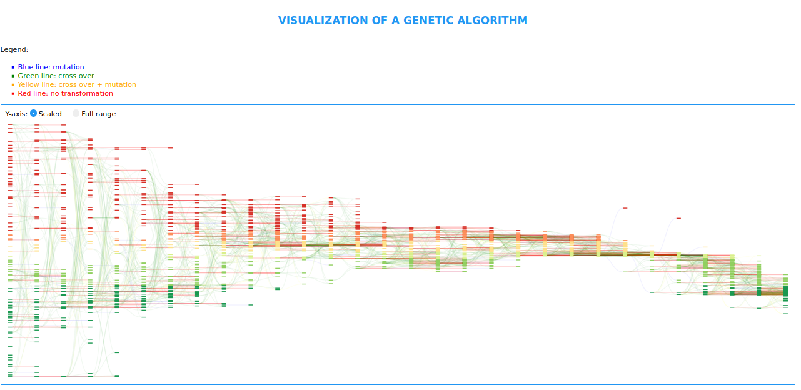
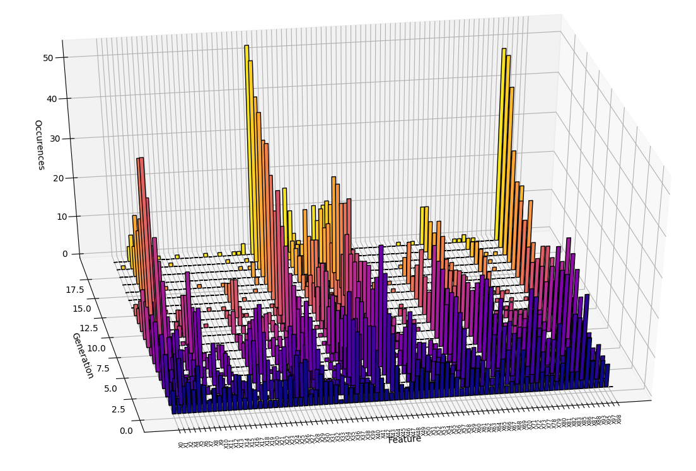

# Algorithms
Here you may find canonical approches to solve optimization problems with genetic algorithms (GAs) I will present here the different approaches. If you are completly new to GAs I suggest a bit of reading [here](https://en.wikipedia.org/wiki/Genetic_algorithm#Optimization_problems) that will help you understand the concept of GAs.

All my algorithm can output a pickle file that contains all the runs executed by the GA that can be used for creating visualizations


## Utils

General purpose utility functions and utility decorators that are common to all algorithms can be found in utils.py

For coding the genetical algorithm I needed some classes for making the interaction between the genotype and phenotype, these classes can be found in dna_translator.py

For  evaluating the models I needed to code specific Fitness objects that are available in the custom_fitnesses.py file

These three files have unit tests coded in the folder Utils/tests to make sure that they have the correct behavior: of course is can giv you some insights and some example of the inner working of the algorithms (but all the code is here so why having just insights when you can have the whole code!)

## Algorithms

### Simple Discrete GA
Canonical and first approach (to my knowledge) to a genetic algorithm: discretizing intervals and making optimization on a discrete grid on a single objective.
Is is not able to find the global extremum on continuous intervals however it is much more efficient than a grid search approach as it will focus on the most interesting zones of the design space:any lethal argument will be eliminated on the first generation while this is not the cas ein a grid search approach

An example is provided in the ```__main__``` function on a simple linear function.

This genetic algorithm is useful however the fact that it has only one fitness is problematic: sometimes we are performing grid search to look for different combinations but it is interesting to introduce some parcimonious constraints. Indeed sometimes answering an optimization problem can lead to overfitting therefore it would be interesting to add a "simplicity metric" that would enforce the genetic algorithm to find the best and yet simple solution. This is why I implemented a genetic algorithm that can deal with multiple metrics (see multicriteria GA)


### Multicriteria GA
Adding a multicreteria fitness to allow giving more weight to one fitness comapred to the other, allows to explore solutions that try to find a compromise between two (or more) metrics. I develloped this script in order to make automated hyperparameter tuning in statistical models. I had two metrics of performance: the first one was the accuracy of the model and the second one was the complexity of the model (for a neural network, complexity can be mesured by the number of synaptic weights) and therefore I ran the genetic algorithm (with the right weights for the fitnesses) for it to find the optimal neural network in terms of accuracy and simplicity (I'll present this work in another github repo)

As usual there is a simple example at the end of the script in the ```__main__``` function on a linear function

### Continous GA
This algorithm does optimization of a continuous space, therefore the corss over and the mutation cannot be the same than on discrete spaces: the mutation is gaussian (it perturbs randomly with some noise) and the cross operation operates on each gene: the value of the child is taken uniformly in the interval of the values of the parent.

This algorithm can be used to find an optimal set of continuous values, it allows to explore the design space in a linear scale of a logarithmic scale.

An example is provided in the ```__main__``` function on a simple quadratic function

### Hybrid GA

Mixing the Continuous and Discrete approach to allow solving problems with both continuous and discrete parameters, allows discrete parameters along with different scales of continuous parameters.

This algorithm is straight forward if you are familiar with the continuous approach and the discrete approach presented presented above.


## Experiments

### Constrained GA
Implementation of an approach to deal with contraints on genetic algorithms without penalizing the fitness ([paper](https://arxiv.org/abs/1610.00976))
This required to create a new fitness object to count the constraints and to reconfigure the comparison operators
It gave really interesting results especially when the solution respects all the constraints and the GA tries to explore the different boundaries.
I show here the evolution of the percentage of constraints met thoughout the generations on a problem that had 52 constraints.
In this problem the goal was to optimize a set of coefficients to reduce an error but the solution had to respect a high number of constraints
<p align="center">
	
</p>
Here we plot the evolution of the error averaged over the population
<p align="center">
	
</p>
The visualizations were created with the tools in the folder "Visualizations"

### Hybrid with variable mutation
Implementation of a mutation rate that is coded in the genotype of the individual, allows different behaviors in the same population. When the algorithm converges we observe a decreasing of the mutation rate in the population. It could be used to detect if the algorithm is stuck in a local minimum
here I plot the evolution of the mutation rate in the population: it is very interresting to see the individuals that don't mutate enough and the one that mutate to much are not selected but that at the end of the evolution when the algorithm has found the global extremum the mutation rate drops as the individuals are craving to be stable in this extremum
<p align="center">
	
</p>

### Genetic Feature Selection
Feature selection using genetic algorithms, it has proven quite useful to test different combinations of inputs. I used it in my former company to select features for au Gaussian process: we had 82 different features and we were trying to select the ones that were the most relevant therefore I ranthis algorithm and plot the occurences of an index in the population at every generation
<p align="center">
	
</p>


