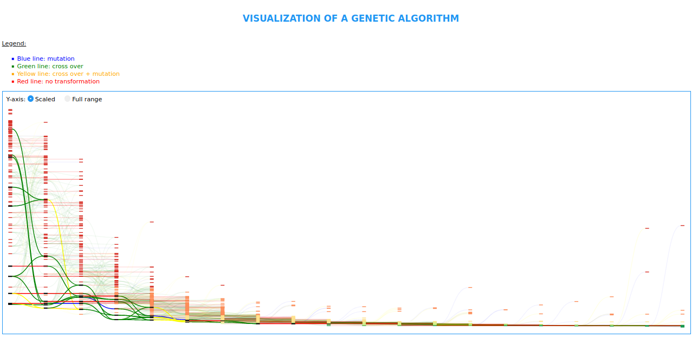
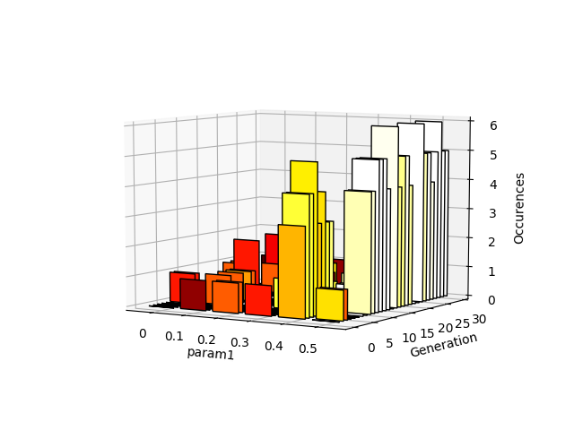
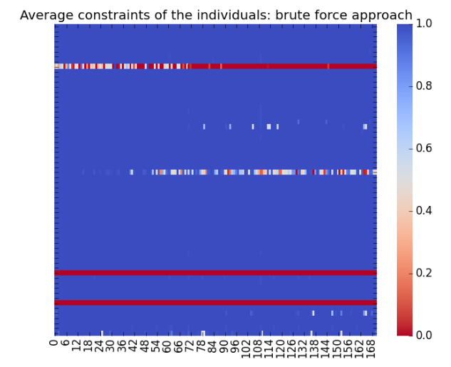
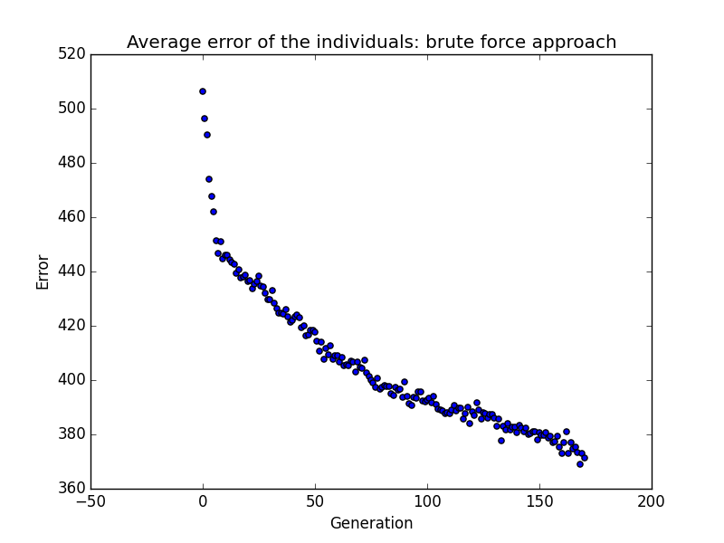

# Visualization
One of the main tools in this folder are the visualizations that I offer on the algorithms that I provide in the Algorithm folder. These algorithms are all producing an output file (a pickle binary file) that have a specific format, the pickle file contains the parameter space and the populations
```javascript
pops=[
	[
		indiv_1_of_generation_0,
		indiv_2_of_generation_0,
		indiv3_of_generation_0,
	],
	[
		indiv_1_of_generation_1,
		indiv_2_of_generation_1,
		indiv3_of_generation_1,
	],
	]

```
where
```javascript
indiv = {"fits":fitness_tuple,
		 "phen":phenotype_of_individual,
		 "age":age_of_individual,
		 "id":id_individual,
		 "parents":couple_of_ids,
		 "mutated":id_origin_indiv
}

```
These information allow us to link an individual to the previous generation, who is linked to the previous one etc... We can therefore build the genealogic tree which is exactly what does the ```board.py``` script.

## The Board
<p align="center">
	
</p>

 It runs a flask local web server and serves a visualisation of the fitness (The D3.js that does the visualization is largely inspired from [this one](http://karstenahnert.com/gp/), thank you Karsten Ahnert!) all you need to do is run the following command:

``` python3 board.py --log_file=../path_pickle_file.pk``` 
This will display on a web page (http://0.0.0.0:5000/dashboard) the evolution of the first fitness, however you might want to display the evolution of different fitnesses therefor you can add in the arguments of the http request fitness=1 (http://0.0.0.0:5000/dashboard?fitness=1) to display the second fitness, you can even display the evolution of one of the parameters by putting fitness=param (http://0.0.0.0:5000/dashboard?fitness=param1). X-axis is presenting the generations, on top it's the lowest values and at the bottom the highest values (this is contre intuitive I am sorry) of the metric that you have chosen to display the operators that link one generation to another are represented by different color.  You can therefore see where does the individual come from, which where the evolution operators that made the main steps towards the global optimum

 As this board is built using d3.js it is interactive you can select which genealogy you want to display by simply clicking on an individual. I truly advise using the scaled Y-axis (that you can select when the web page is open because it displays nicely the global evolution of the population)

## Displaying categories
The Board works for all kind of parameter that has a numerical value, although the display is not really interesting for numerical but discrete it works, that is why for categorical I advise using a simpler visualization you may find it in the script plot_generation.py. It is using matplotlib and python and displays the number of occurence of a gene thoughout the generations:
<p align="center">
	
</p>
We see that in this case this gene 0.5 gave the best advantage as it was selected in the last generations. The color of the bar represents the mean fitness of the individuals counted in the bar therefor the brighter the higher advatage the gene is giving in average. This visualization was made earlier than the two others the code is less user-friendly: it is hard to tune to find the right set of values for the evolution of the fitness to be plotted in a elegant manner. I advise using it when your fitness is scaled between 0 and 1 (or to perform a preprocessing of the fitnesses for them to be evenly distributed between 0 and 1) only at this moment you'll enjoy the whole colormap. 


## A Constraint visualizer
For the constraints, I needed a special visualization to display the evolution of the constraints along the generation. I built a class that you inherit from to add your own vizualization to your application.
For now it has only two vizualizations: one for constraints one for the weighted sum of the fitnesses.
<p align="center">
	
</p>
Here we plot the evolution of the error averaged over the population
<p align="center">
	
</p>


